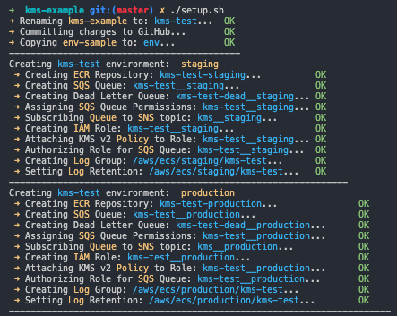
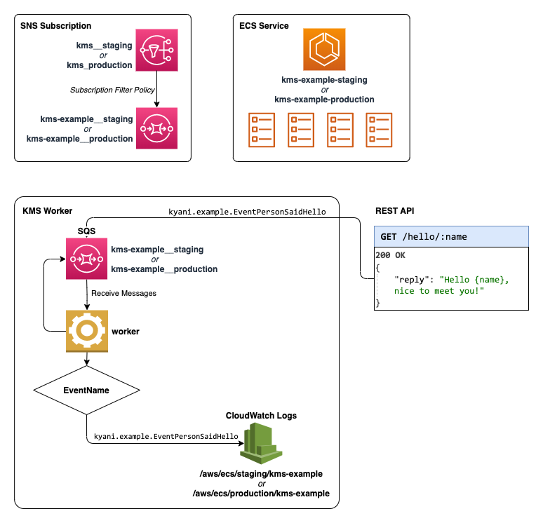

# Example Microservice

[](https://github.com/kyani-inc/kms-example/actions?query=workflow%3AStaging)
[](https://github.com/kyani-inc/kms-example/actions?query=workflow%3AProduction)

This is an example second-generation [KMS](https://github.com/kyani-inc/kms/tree/v2.x/v2) microservice running in both staging and production. It showcases all available KMSv2 service layers (gRPC, REST, and Worker).

## Creating New Services

To create a new service, click the `Use this Template` button to copy this skeleton to a new repository. From there, clone the new repository and run `./setup.sh` to setup the basics for your new service:



**⚠️ NOTE:** You must have `AWS_ACCESS_KEY_ID` and `AWS_SECRET_ACCESS_KEY` variables in your environment as well as appropriate AWS permissions to run this script correctly.

--------------------------

## Service Diagram



## Getting Started

1. Copy `env-sample` to `env` and add your credentials
2. Ensure you have installed `protoc` (see [here](https://github.com/kyani-inc/proto#compiling-protocol-buffer-definitions)).
3. Ensure you are connected to the Kyäni VPC

Run:

```bash
➜ make proto
➜ make api
```

----------------------------------------------------------

## gRPC Service

The example microservice uses the following service definition: [service.proto](https://github.com/kyani-inc/proto/blob/master/example/service.proto)

----------------------------------------------------------

## REST Endpoints

Swagger documentation for the REST layer is created using [Swag Declarative Comments](https://github.com/swaggo/swag#declarative-comments-format) and is generated automatically by KMSv2 on deployment. Documentation for this API can be accessed using the [KMS CLI](https://github.com/kyani-inc/kms/tree/v2.x/v2#command-line-tool) and the `docs` command to return/open a URL to the Swagger server.

```bash
$ kms docs kms-example
Documentation URL:
➜ http://abab38c3-b7e8-461a-aaaf-c6a783602f90.example.staging.kms.kyani:33276/docs
```

**⚠️ NOTE:** You must be connected to the Kyäni VPN for this command to work.

----------------------------------------------------------

## Events Subscriptions

Definitions for the events that are published by `kms-example` can be found in the [Kyäni Proto](https://github.com/kyani-inc/proto/blob/master/example/events.proto) repository. `kms-example` also _subscribes_ to the following events:

### `kyani.example.EventPersonSaidHello`

Example event for saying hello and demonstrating KMS Events functionality
